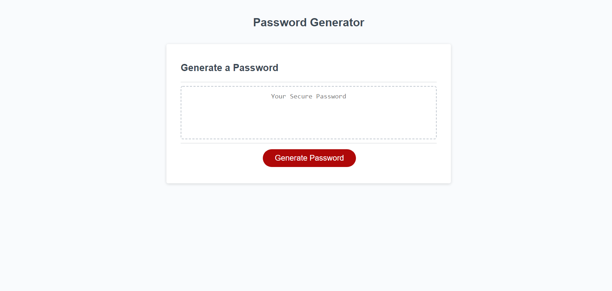

# Password Generator

## Purpose
- To allow the user to input parameters for a password
- To allow those parameters to be concatenated into one password
- To generate a random password using those parameters
- Achieve all of these using Javascript

### Contains
HTML, CSS, Javascript.

Site deployed at [password-challenge](https://aucoats.github.io/password-challenge).

Deployed image: 
.
